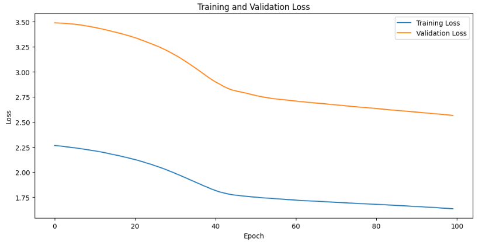
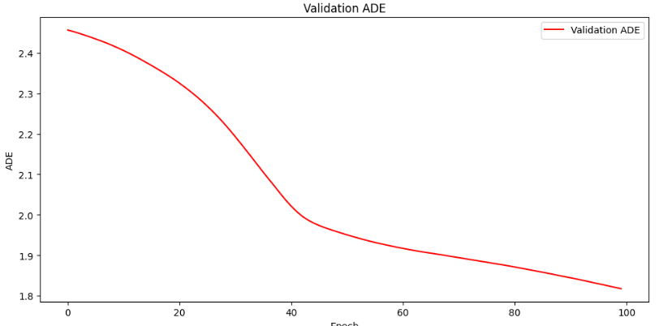
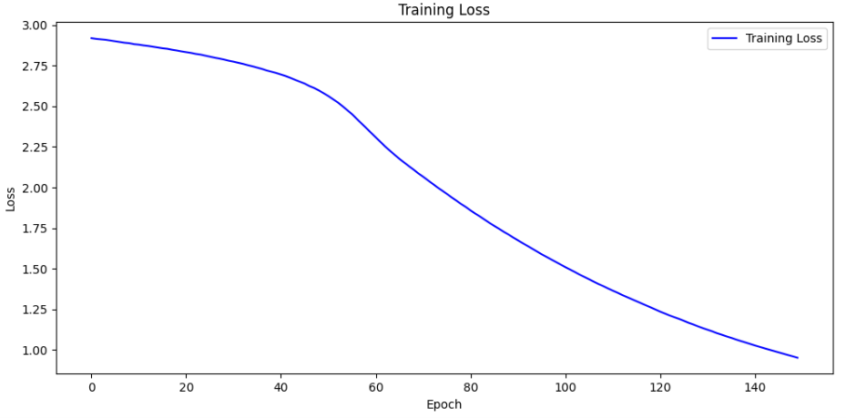
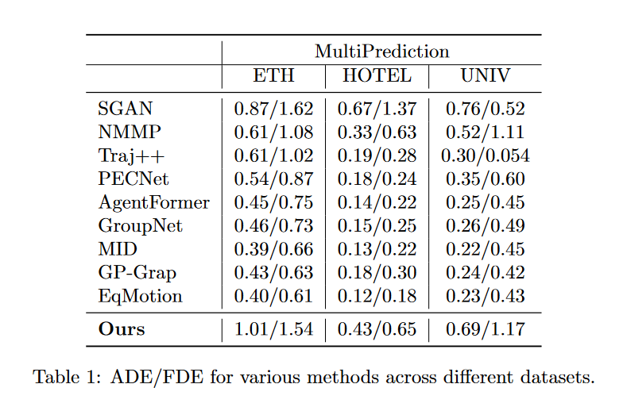

# EquiPredict: Robust Interaction Modeling for Multi-Agent Motion Forecasting


## Project Description 
The ability to understand and predict the motion of multiple agents in dynamic environments is crucial for a range of applications, from autonomous vehicles navigating urban streets to sophisticated pedestrian traffic management systems. Despite considerable advancements, existing motion prediction methods often struggle to capture the intricate interdependencies and the variability these agents exhibit in real-world settings.  
In our project, we propose several experiments to explore the importance of equivariance and invariance in our multiprediction task.  
<p align="center">
  
</p>


## Repository Content 
* **'dataset'** : scripts of the dataset used to process and manage trajectory data  
* **'preprocessing'** : scripts dedicated to data cleaning, transformation and preparation 
* **'model'** : all sub-networks and models needed to achieve our task 
* **'options.py'** : parser options for both train and test so to adjust parameters when needed 
* **'train_test_val.py'** :  script that contains training, validation and test loop 
* **'main.py'** :  script to train and test the model 
* **'equipredict.ipynb'** : our runnable network. It contains all sub-networks and models used to complete the required task. It was trained and tested on "kaggle" using GPU-P100   
* **'utility_functions.py'**: script containing all the extra functions we needed in our notebook
* **'results'** : plots of losses and metrics 


## Dataset 
We conduct experiments on pedestrian trajectory prediction using the ETH dataset, which contains 3 subsets : ETH, HOTEL, UNIV.  

**BIWI Dataset** : Annotations file given in BIWI dataset can be found at https://icu.ee.ethz.ch/research/datsets.html

<p align="center">
  
</p>

The image above is an example of annotation taken from biwi_eth_train.txt. Data is reported in the format **<Frame_Id, Pedestrian_Id, X_coordinate, Y_coordinate>**.

Following the standard setting, we use 3.2 seconds (8 timestamps) to predict 4.8 seconds (12 timestamps).

Our preprocessing pipeline goes through several stages to ensure the integrity and quality of the data used for our models: 
- The process begins with the loading, filtering and processing of trajectory data to generate motion vectors and masks for valid agents appearing in both past and future frames.
- To handle 'None Data' due to missing information, We provide two approaches to handle "invalid entries" :  
    - In the first implementation, invalid entries are bypassed, focusing solely on valid agents, causing a reasonable data loss. 
    - To address this limitation, the second implementation replaces invalid entries with the most recent valid data 
- The final datasets are constructed based on these preprocessing methods 
- *Discrete Cosine Transformation* (DCT) is applied to transform the data in the *frequency domain* 

## Proposed Method 

Our method is composed of the following three building blocks : 
- **Feature Initialization Module** : All input features are initialized and transformed into a more suitable format for subsequent processing by other parts of the model.
- **Interaction Graph Module** : It captures agent interactions by processing their feature vectors. It includes a refinement of individual node features after their interactions and an analysis of combined features of agent pairs to learn about their direct interactions. K-means clustering is then used to categorize these interactions into predefined groups based on feature similarity. 
- **Feature Learning Module** : It is used to process agent features dynamically, to update their states based on agent interactions, and to selectively focus on relevant data through a self attention mechanism. 

**EquiPredict Module** : The final model leverages various neural network techniques to interpret and predict complex motion patterns based on relational data. It simplifies features like speed, direction, and position into a lower-dimensional space for efficient processing. Interactions are classified into categories using message passing and aggregation techniques, then processed through Feature Learning layers to update each node's representation based on its neighbors. Recurrent processing also allows the model to consider temporal evolution of interactions and states. Prediction are then computed using multiple prediction heads. Each head processes the refined node features to produce outputs related to the coordinates of the agents. Then, having applied DCT before, coordinates are transformed back from the frequency domain to the spatial domain using the inverse DCT.


Below there's a graphical representation of network implemented in the original paper https://arxiv.org/pdf/2303.10876.

In our project, we try to re-implement it and we propose modifications to the architecture, running experiments to understand how to achieve equivariance and invariance in our multiprediction task . 

<p align="center">
  
</p>


## Metrics and Results 
To evaluate the performance of our model, we use : 
- *Average Displacement Error (ADE)* : It refers to the mean square error (MSE) over all estimated points of every trajectory and the true points. 
- *Final displacement error (FDE)* : It refers to the distance between the predicted final destination and the true final destination at the T pred time.

Below we report some of the results we have achieved: 

**Results for Modified Architecture with Feature Learning Layer without Reasoning Module, but added Recurrency, GCL layer and MHA in EquiPredict**  

- *AgentPreprocessing without Invalids Data Results on ETH* : 

<div style="display: flex; justify-content: center; align-items: center;">
  <div style="text-align: center; margin-right: 20px;">
    
    <p><strong>ETH FDE 100 Epochs</strong></p>
  </div>
  <div style="text-align: center;">
    
    <p><strong>ETH ADE 100 Epochs</strong></p>
  </div>
</div>

- *AgentPreprocessing with Invalids Data Results on ETH* :   
<div style="display: flex; justify-content: center; align-items: center;">
  <div style="text-align: center; margin-right: 20px;">
    
    <p><strong>ETH FDE 100 Epochs</strong></p>
  </div>
  <div style="text-align: center;">
    
    <p><strong>ETH ADE 100 Epochs</strong></p>
  </div>
</div>

From the above plots, we can see that, despite the data loss, processing only valids results achieves a slightly better performance. For this reason, we decided to perform further tests only considering valid data.  
**Following results assume AgentPreProcessing without Invalids is used** 

- *Results on UNIV* :
<div style="display: flex; justify-content: center; align-items: center;">
  <div style="text-align: center; margin-right: 20px;">
    
    <p><strong>UNIV FDE 100 Epochs</strong></p>
  </div>
  <div style="text-align: center;">
    
    <p><strong>UNIV ADE 100 Epochs</strong></p>
  </div>
</div>

- *Results on HOTEL* : 
<div style="display: flex; justify-content: center; align-items: center;">
  <div style="text-align: center; margin-right: 20px;">
    
    <p><strong>HOTEL FDE 100 Epochs</strong></p>
  </div>
  <div style="text-align: center;">
    
    <p><strong>HOTEL ADE 100 Epochs</strong></p>
  </div>
</div>

From the above plots, we observe that the Reasoning Part plays a crucial role in guaranteeing invariance and equivariance properties for our model. For this reason, we provide a re-implementation of it achieving these results 

**Results for re-implemeted Feature Learning with additional K-Means to compute interaction categories and  recurrency, GCL layer and MHA in EquiPredict** 
- *Results on ETH*:
<div style="display: flex; justify-content: center; align-items: center;">
  <div style="text-align: center; margin-right: 20px;">
    
    <p><strong>ETH FDE 150 Epochs</strong></p>
  </div>
  <div style="text-align: center;">
    
    <p><strong>ETH ADE 150 Epochs</strong></p>
  </div>
</div>

- *Results on UNIV*:
<div style="display: flex; justify-content: center; align-items: center;">
  <div style="text-align: center; margin-right: 20px;">
    
    <p><strong>UNIV FDE 150 Epochs</strong></p>
  </div>
  <div style="text-align: center;">
    
    <p><strong>UNIV ADE 150 Epochs</strong></p>
  </div>
</div>


- *Results on HOTEL*:
<div style="display: flex; justify-content: center; align-items: center;">
  <div style="text-align: center; margin-right: 20px;">
    
    <p><strong>HOTEL FDE 150 Epochs</strong></p>
  </div>
  <div style="text-align: center;">
    
    <p><strong>HOTEL ADE 150 Epochs</strong></p>
  </div>
</div>


## Comparison with SOTA 
<p align="center">
  
</p>


## Final Observations and Future Works

As we can observe from the table above, we achieve reasonable results. We want to further enhance our architrecture, trying to improve the equivariance and invariance properties of our model. Moreover, we would like to integrate it with autonomous vehicles and robotics for improved motion planning and prediction.


## Acknowledgments
* The original paper:

```bib
@misc{xu2023eqmotionequivariantmultiagentmotion,
      title={EqMotion: Equivariant Multi-agent Motion Prediction with Invariant Interaction Reasoning}, 
      author={Chenxin Xu and Robby T. Tan and Yuhong Tan and Siheng Chen and Yu Guang Wang and Xinchao Wang and Yanfeng Wang},
      year={2023},
      eprint={2303.10876},
      archivePrefix={arXiv},
      primaryClass={cs.CV},
      url={https://arxiv.org/abs/2303.10876}, 
}
```

* Other Related Works : 

```bib
@misc{yuan2021agentformeragentawaretransformerssociotemporal,
      title={AgentFormer: Agent-Aware Transformers for Socio-Temporal Multi-Agent Forecasting}, 
      author={Ye Yuan and Xinshuo Weng and Yanglan Ou and Kris Kitani},
      year={2021},
      eprint={2103.14023},
      archivePrefix={arXiv},
      primaryClass={cs.AI},
      url={https://arxiv.org/abs/2103.14023}, 
}
```

```bib
@misc{yuan2021agentformeragentawaretransformerssociotemporal,
      title={AgentFormer: Agent-Aware Transformers for Socio-Temporal Multi-Agent Forecasting}, 
      author={Ye Yuan and Xinshuo Weng and Yanglan Ou and Kris Kitani},
      year={2021},
      eprint={2103.14023},
      archivePrefix={arXiv},
      primaryClass={cs.AI},
      url={https://arxiv.org/abs/2103.14023}, 
}
```
